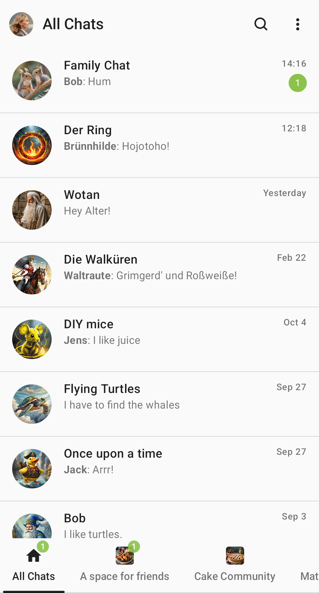
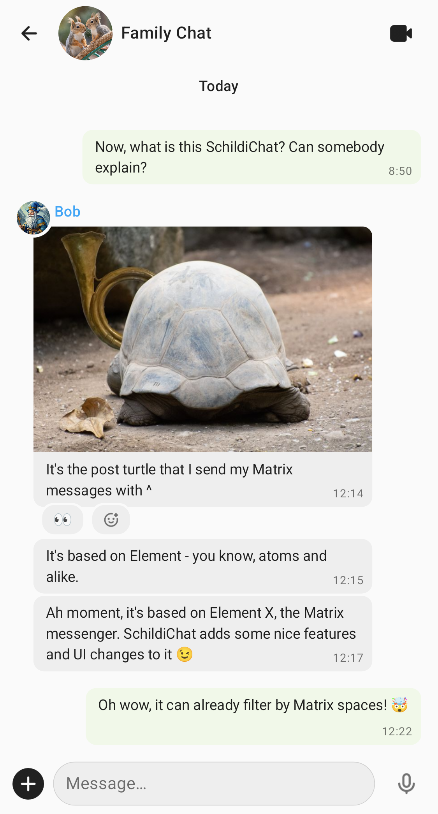
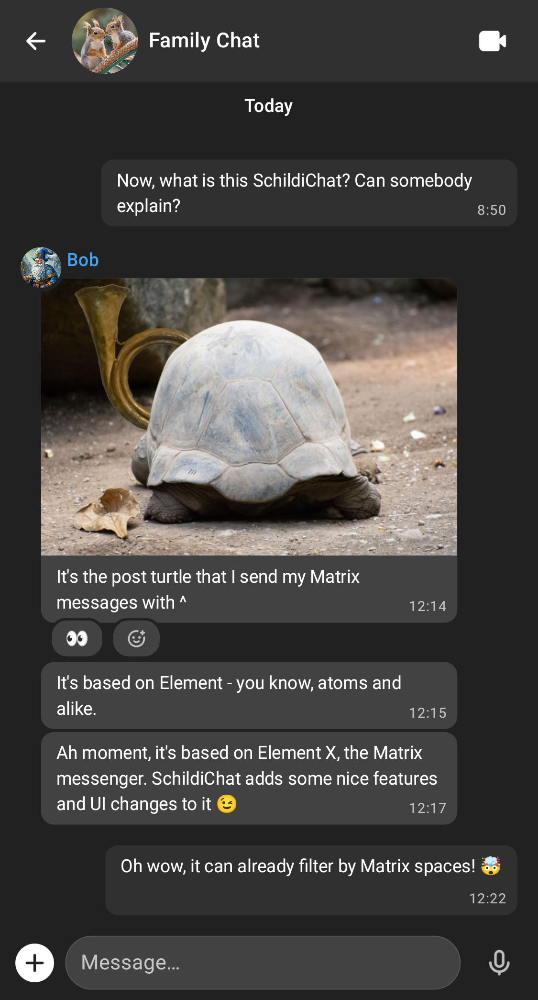

SchildiChat Next is a Matrix Client based on [Element X Android](https://github.com/element-hq/element-x-android) with some [extras and tweaks](https://github.com/SchildiChat/schildichat-android-next/blob/main/FEATURES.md), and will replace the [legacy Android client](../) in the future.

**Discussion**: [#android:schildi.chat](https://matrix.to/#/#android:schildi.chat)  
**Release announcements**: [#android-next-announcements:schildi.chat](https://matrix.to/#/#android-next-announcements:schildi.chat)

## Screenshots

## Download

## Beta/test releases

